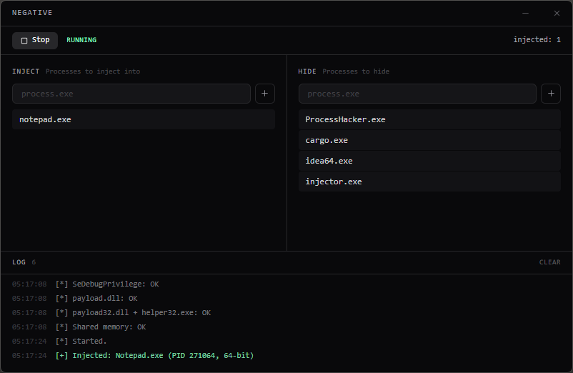

# negative

A user-mode process hiding toolkit via DLL injection and API hooking.

## Features

- Inject DLLs into target processes (x64 / x86)
- Hide processes from task managers and other monitoring tools
- Real-time shared memory communication between injector and payload
- Hooks `NtQuerySystemInformation` and `ZwOpenProcess` to filter process lists